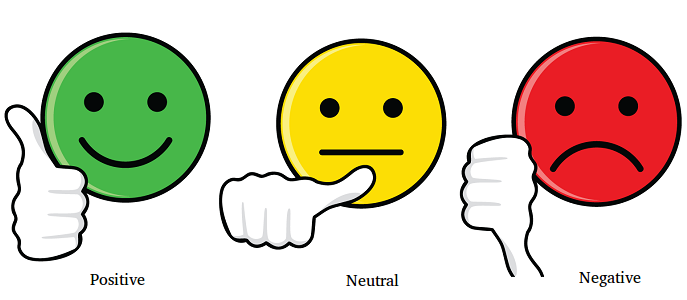
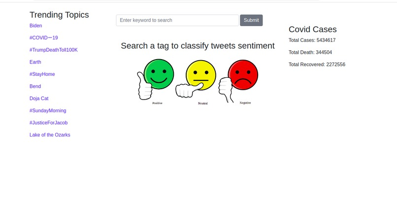
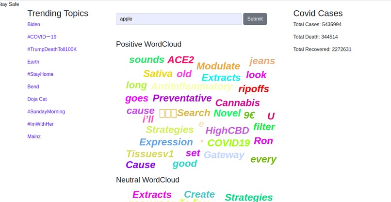
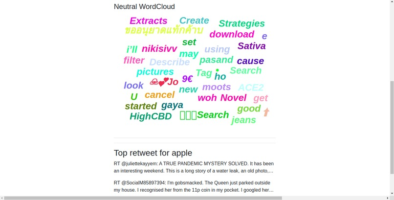

<p align="center">
  
</p>

# Tweet Sentiment Word Cloud

[](LICENSE)


**Tweet Sentiment Word Cloud** is a tool for Analyzing twitter tweets for a keyword and distinguishing sentiment by positive, negative and neutral. And finding most frequently used word to determine sentiments. 

***You can check out the Tweet Sentiment Word Cloud from below 👇***

[Twitter Sentiment Analysis](https://ran010.github.io/web-sentiment-analysis/)

<table style="width:100%">
  <tr>
    <td></td>
    <td></td>
    <td></td>
  </tr>
</table>

## About
- The project divides the tweet into three different sentiments and create a wordcloud among them with most frequent used words.
- The project was submitted in [OpenHacks 2020](https://hack.theopencode.org/)


## Built With 🛠
- [Python](https://www.python.org/) - Python is an interpreted, object-oriented, high-level programming language with dynamic semantics
- [Flask](https://flask.palletsprojects.com/en/1.1.x/) - Flask is a popular, extensible web microframework for building web applications with Python.
- [Natural Language Toolkit](https://www.nltk.org/) - NLTK is a leading platform for building Python programs to work with human language data.
- [React](https://reactjs.org/) - A JavaScript library for building user interfaces
- [react-tagcloud](https://www.npmjs.com/package/react-tagcloud) - Simple and extensible tag/word cloud React component.
- [Tweepy](https://www.tweepy.org/) - An easy-to-use Python library for accessing the Twitter API.
- [VADER-Sentiment-Analysis](https://github.com/cjhutto/vaderSentiment) - VADER (Valence Aware Dictionary and sEntiment Reasoner) is a lexicon and rule-based sentiment analysis tool that is specifically attuned to sentiments expressed in social media.


## Credits
Thanks to 
- [Novel COVID API](https://corona.lmao.ninja/) for open-source API.


## Contributed By:
- [Ranjan Bir Bajracharya](https://github.com/ran010) (Team Leader)
- [Debaleen Das Spandan](https://github.com/the-it-weirdo) (Contributer)
- [Shouvit Pradhan](https://github.com/shaw8wit) (Contributer)
- [Bijayata Shrestha](https://github.com/shresthabijayata4) (Contributer)

## License
```
MIT License

Copyright (c) 2020 Ranjan Bir Bajracharya and Debaleen Das Spandan and Shouvit Pradhan and Bijayata Shrestha

Permission is hereby granted, free of charge, to any person obtaining a copy
of this software and associated documentation files (the "Software"), to deal
in the Software without restriction, including without limitation the rights
to use, copy, modify, merge, publish, distribute, sublicense, and/or sell
copies of the Software, and to permit persons to whom the Software is
furnished to do so, subject to the following conditions:

The above copyright notice and this permission notice shall be included in all
copies or substantial portions of the Software.

THE SOFTWARE IS PROVIDED "AS IS", WITHOUT WARRANTY OF ANY KIND, EXPRESS OR
IMPLIED, INCLUDING BUT NOT LIMITED TO THE WARRANTIES OF MERCHANTABILITY,
FITNESS FOR A PARTICULAR PURPOSE AND NONINFRINGEMENT. IN NO EVENT SHALL THE
AUTHORS OR COPYRIGHT HOLDERS BE LIABLE FOR ANY CLAIM, DAMAGES OR OTHER
LIABILITY, WHETHER IN AN ACTION OF CONTRACT, TORT OR OTHERWISE, ARISING FROM,
OUT OF OR IN CONNECTION WITH THE SOFTWARE OR THE USE OR OTHER DEALINGS IN THE
SOFTWARE.
```
